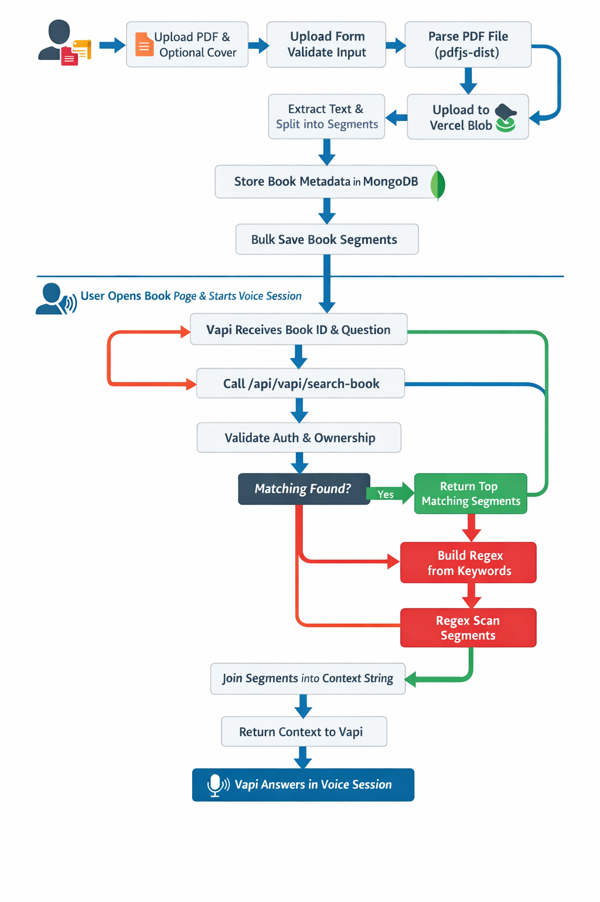
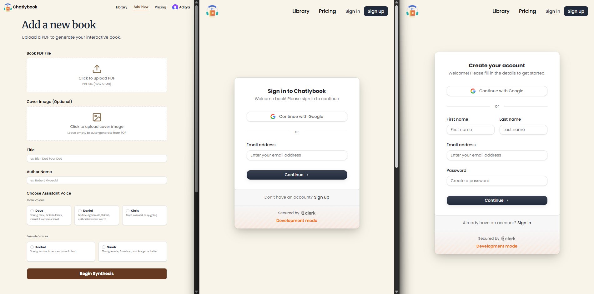
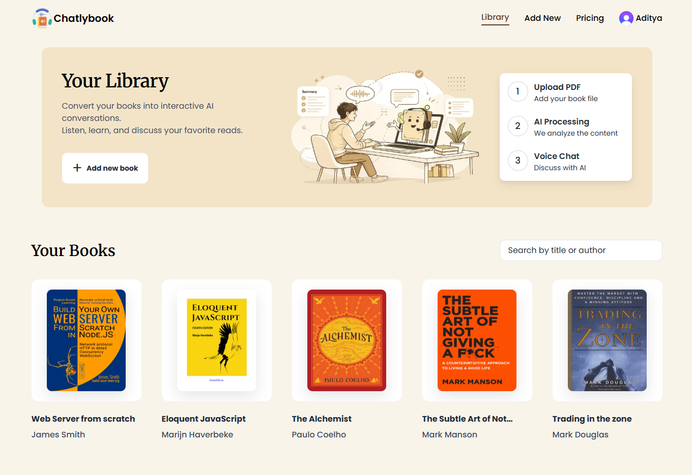
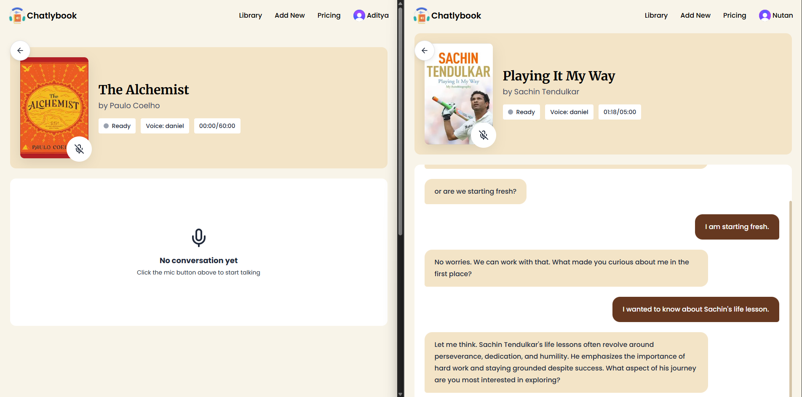
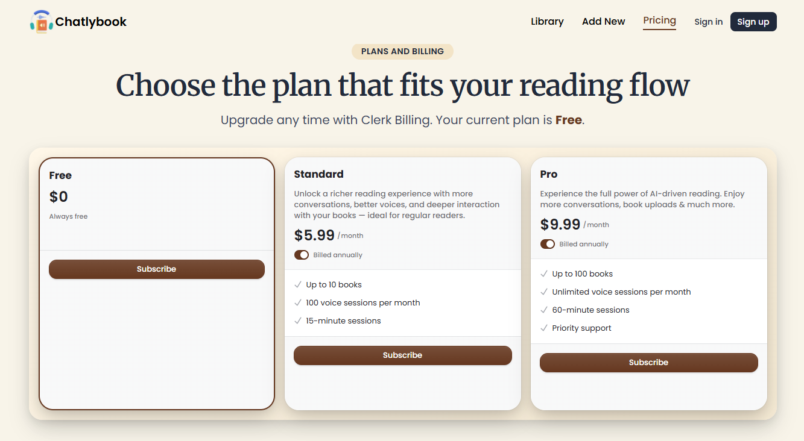

# Chatlybook

Chatlybook turns static PDFs into interactive, voice-driven assistants

## What it does?

- Authenticates users with Clerk and keeps each library private.
- Lets readers upload a PDF, convert it into searchable text segments, and speak with an AI voice assistant that answers using the actual contents of the book. It combines PDF parsing & chunk-based retrieval.
- Enforces subscription limits for book uploads and monthly voice sessions.

## Technical Decisions

- **Client-side PDF parsing**: parsing happens in the browser so the app can extract text and generate a cover preview before persistence, without adding a server-side PDF processing pipeline.

## Flow Diagram: PDF Parsing To Vapi Context ( Architecture )



Step by step:

1. The upload starts in `components/UploadForm.tsx`, where the signed-in user submits a title, author, persona, PDF, and optional cover.
2. `parsePDFFile` in `lib/utils.ts` loads the PDF with `pdfjs-dist`, extracts page text, renders the first page into a cover image when needed, and splits the full text into smaller segments.
3. The original PDF and the cover image are uploaded to Vercel Blob through the authenticated `app/api/upload/route.ts` token flow.
4. `createBook` writes the top-level book document, including owner, blob URLs, file size, slug, and selected voice persona.
5. `saveBookSegments` bulk-upserts segment rows into the `BookSegment` collection and updates `totalSegments` on the parent book.
6. When the user opens the book page and starts a conversation, `hooks/useVapi.ts` starts a tracked voice session and passes `bookId`, `title`, and `author` into the Vapi assistant call.
7. During the call, Vapi invokes the `searchBook` tool, which lands in `app/api/vapi/search-book/route.ts`.
8. The route calls `searchBookSegments`, which first tries MongoDB text search on the selected book for the authenticated user.
9. If text search yields nothing, the app escapes each keyword and falls back to a case-insensitive regex query across stored segment content.
10. The matched segments are concatenated into a single context string and sent back to Vapi, which uses that text to answer the user during the voice session.

## Tech Stack Used

- **Next.js 16 App Router**: page routing, route handlers, server rendering, and server actions.
- **React 19**: interactive upload, search, and voice-session UI.
- **TypeScript**: typed models, actions, hooks, and form contracts.
- **Clerk**: authentication, manage | update profile, subscription plans & billing.
- **MongoDB + Mongoose**: storage for books, segments, and voice-session records.
- **Vercel Blob**: persistent storage for raw PDF files and cover images.
- **pdfjs-dist**: browser-side PDF text extraction and cover generation.
- **Vapi Web SDK**: browser voice session control and assistant connection.
- **Tailwind CSS v4**: utility-first styling across pages and components.
- **shadcn/ui + Radix primitives**: form controls and reusable UI building blocks.
- **Zod + React Hook Form**: upload-form validation and typed form state.
- **Sonner**: toast notifications for upload, auth, and session feedback.

## Running locally

### Prerequisites

- Node.js 20 or newer.
- A MongoDB database.
- A Clerk application.
- A Vercel Blob token.
- A Vapi assistant and public API key.

### Environment variables

Create a local environment file with the values required by the current codebase:

```bash
MONGODB_URI=
BLOB_READ_WRITE_TOKEN=
NEXT_PUBLIC_VAPI_API_KEY=
NEXT_PUBLIC_ASSISTANT_ID=
NEXT_PUBLIC_CLERK_PUBLISHABLE_KEY=
CLERK_SECRET_KEY=
```

### Install and run

```bash
npm install
npm run dev
```

Open `http://localhost:3000` and sign in before testing uploads or voice sessions.

### Validation commands

```bash
npm run lint
npm run build
```

## Screenshots:



> Add new book form & user auth pages



> Uploaded books list



> Start voice conversation & session live voice to text display page



> Free, standard, pro subscription models
